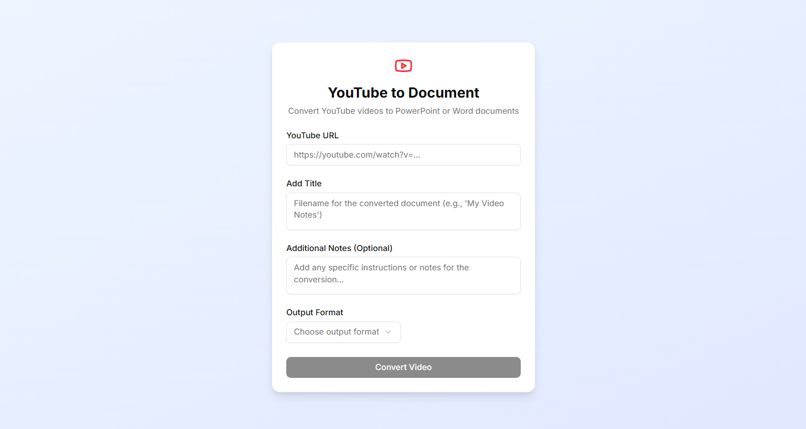

# YouTube to Document Converter

Convert any YouTube video into a downloadable **PowerPoint (`.pptx`)** or **Word Document (`.docx`)**, using the power of Gemini and modern UI.


---

## ✨ Features

- ✅ Paste any valid YouTube URL
- ✅ Choose between PPTX or DOCX output
- ✅ Add custom title and notes
- ✅ Gemini-based smart transcript summarization
- ✅ Fully client-side document download

---

## 📦 Project Structure

- `YouTubeConverterForm`: Accepts URL, title, notes, and output format
- `ProcessingPage`: Orchestrates async pipeline (transcript → Gemini → format)
- `ResultsPage`: Handles document generation and download
- `generate-docx` / `generate-pptx`: Converts Gemini output to `.docx` or `.pptx`
- `api/` routes: Backend endpoints for transcript extraction and Gemini processing

---

## ⚠️ Sub-Project Dependency

This project **requires a deployed subproject/API service** to function:

> 🔗 Must deploy [`yt-transcriber-api`](https://github.com/AlynxNeko/yt-transcript-api) 
> The following endpoints must be available:
> - `POST /api/transcript` → returns transcript
> - `POST /api/generate` → returns Gemini-formatted content

Update your `fetch` URLs if deploying elsewhere.

---

## 🚀 Setup Instructions

### 1. Clone the repo

```bash
git clone https://github.com/your-org/youtube-to-docx-converter.git
cd youtube-to-docx-converter
```

### 2. Install dependencies
```bash
npm install
# or
pnpm install
```
### 3. Environtment Setup
Rename .example.env.local and change it's content
```env
OPENAI_API_KEY="NOT_REALLY_USED_NOW"
GEMINI_API_KEY="YOUR_GEMINI_API_KEY"
TRANSCRIPT_API_URL="https://your-api.com/api/transcript" # From the yt-transcriber-api github that you deployed
```
Currently the OPENAI isn't used yet

### 4. Start the dev server
```bash
npm run dev
```
Then go to http://localhost:3000

---

## 🛠 Tech Stack
- Next.js (App Router)
- Shadcn/UI for components
- Lucide Icons
- PptxGenJS and docx for document generation
- Gemini via [Google AI Studio](https://aistudio.google.com/) (could be changed to GPT via OpenAI for better generationn)

---

## 📄 License
This project is licensed under the MIT License — see the [LICENSE](./LICENSE) file for details.

---

## 🙋‍♂️ Author
AlynxNeko
[GitHub](https://github.com/AlynxNeko)

---

## 📎 Screenshots
Add screenshots by placing image links or embedding local images. For example:

---

### Home Page


---

### Conversion Result


---

## 💡 Future Ideas
- Add support for PDF export
- Upload custom transcripts (non-YouTube)
- Login system to track conversion history

